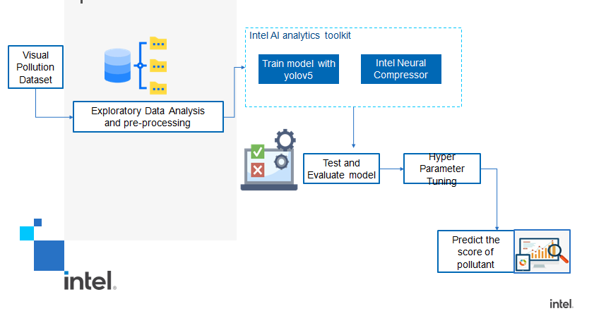

# Webapp

 Visual Pollution has emerged as a new variant to the family of existing pollution, Causes Direct and indirect effects on the environment which made us take up this challenge.

The main goal of the project is to detect and classify Visual pollution-causing elements (e.g. Billboards, Graffiti, potholes) using Intel AI.

As an initial step, we have considered the case of pothole pollutant detection and mapping in the real time for easy identification and repair.

VisiPol Web application detects potholes using Intel OneAPI, Which is a system that utilizes the power of deep learning algorithms and computer vision to analyze images and identify potholes in roads. The web application provides users with an easy-to-use interface to upload images of roads, and then performs real-time analysis of the images using the Intel OneAPI deep learning framework. The system is capable of detecting and localizing potholes within the uploaded images.

It also captures the geo location of the uploaded image and provides the severity of the pothole into three categories such as Severe, Major, Minor. 

This Dashboard provides the government bodies a clear mapped view of the potholes to be repaired. Officials can easily locate the potholes using the maps.

### Proposed Architecture

### Impact of oneAPI Analytics toolkit

Due to the unique quality of one API with regards to its functionality on cross-platform, it is easily implementable on all devices and is easily scalable.
 
With the help of optimized features of AI analytics toolkit, the detection and classification of the potholes happen at a faster pace. We achieved a robust pothole detection model with a greater accuracy for pothole detection.

We utilized a yolo-v5 model, with the data pre-processed from roboflow. The intel AI analytics toolkit served as a great tool to train our model. The pytorch extension for intel helped us to enhance the training and performance.

### Implementation:

As an initial step, we have to upload the image to the dashboard and select our location from the map. Next we send this image to the ML model to predict the score and category of the potholes.These images and the corresponding category tagging is displayed in the dashboard and also on the map, then the municipal people can login and use these data to plan and repair.Predicting the severity of the pothole by tagging it to the category type- severe, major and minor in the dashboard.

## Intel's ONEAPI ToolKit: 
 - Intel Dev Cloud
 - Intel AI Analytics ToolKit
   - Intel Extension for PyTorch
 - Intel Distribution of OPENVINO Toolkit:

### Quick Summary: 

To build and deploy a convolution neural network using the intel oneAPI toolkit to detect, classify and assess the visual pollutants (pothole case) in the given image in real time.

### steps to run the code:

1. Install Flask: Once you have Python installed, you need to install Flask.
2. pip install Flask
3. Install the required modules as defined in requirements.txt
4. Pip install -r requirements.txt
5. Run the application
6. Python run.py

### Demo Link : https://visipol.pythonanywhere.com/
